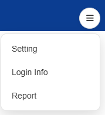

# Welcome to Kindling
This is a website/community that I built for hackers to find project ideas to build, either for fun or for hackathon. However, this website is still in its developing stage.

### Why do I want to create this website?
Personally, I always face the difficulty of coming up with what to build, especially for activities like hack club. I wouldn't consider myself as a super ceative person, so a lot of the times I want to code projects, but I ran out of meaningful ideas.

Kindling allows kids, non-hackers, hackers with creatives ideas to share them, and other hackers can help them build it out. This also allows people from underpriviledged communities to share the products they actually need, instead of many of us imagining what underpriviledged people need.

### Join the Kindling community!
Whether you are looking to see an app you imagined come true or looking for customized softwares to help you some personal or community issues, you are more than welcome to share it here. On the other hand, if you are a hacker looking to get ideas of projects to build, you can take them from Kindling!

## Features on this site:
1. Home page
    - Introduces about this project and the Kindling community
    - Show 3 featured projects of the week
2. Inspirations page
    - Shows all the inspiration posts.
    - Allow users to search for specific topics/titles.
    - Filer by category.
    - Upload your own ideas via the "add" button.
    - Save a post using the "save" button on the bottom left corner of the pop up modal for an inspiration post.
3. Profile page
    - Displays basic info about the user.
    - Add and display projects they coded for specific ideas
    - Display all the inspos the user saved under the "collections" tab.
    - Display ideas/inspiration posts the users added themselves (still have to work on this).

### Things that still need to be worked on:
1. Currently all the database storage is just local storage on the user's browser. I'm planning to move all the database and storage to Supabase storage.
2. I plan to implement a login (Google, Github, Email etc) and an actual account database later.
3. The 3 buttons under the menu button on the profile page (setting, login info, report) do not work yet.
4. The ideas users added through the "add" button on the Inspirations page should be displayed under the inspirations tab on the profile page.
5. If the user uploaded a project they coded for a specific idea, it should somehow notify the author of the idea.